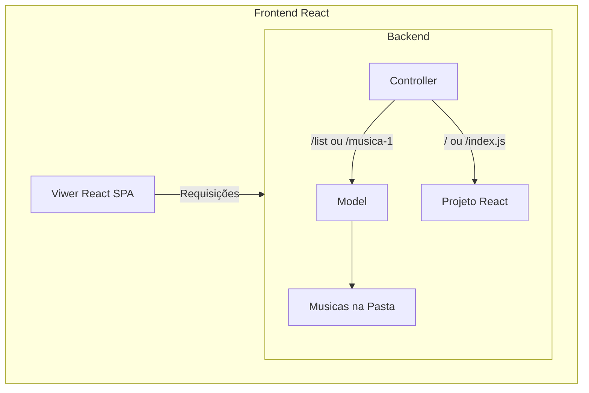

# Notas ao professor
* Escolha Projeto MVC com SPA.
* Usando Express e React
* Listar, Play, Pause, Stop, Proxima, Anterior
* Rotas/APIs `music-player\routes\swagger.yaml` ou http://localhost:8080/api-docs/

Instale o projeto
- >music-player `npm i` Instalando Backend
- >music-player/frontend `npm i` Instalando Frontend
- >music-player/frontend `npm run build` Compilando Frontend react
- >music-player `npm start` Executando Backend
- Abrir http://localhost:8080/

# Notas para devs
Desenvolvendo o projeto frontend:
- >music-player/frontend `npm i`
- >music-player/frontend `npm start`
- Abrir http://localhost:3000/ frontend react para dev

Executando o projeto backend, com front compilado:
- >music-player `npm i`
- >music-player `npm start`
- Abrir http://localhost:8080/
- Documentação em http://localhost:8080/api-docs/
 
# music-player
Título da atividade: Desenvolvimento de um player de música local utilizando diferentes abordagens MVC

Objetivo: Os alunos devem desenvolver um player de música local utilizando as abordagens MVC com Templates, MVC com SPA e MVC com REST. O objetivo é que os alunos possam aplicar os conceitos aprendidos em diferentes abordagens e demonstrar suas habilidades de implementação.

Passos da atividade:

Cada grupo deve escolher uma abordagem arquitetural.

Cada grupo deve desenvolver um player de música que reproduza arquivos de áudio locais. O player deve permitir a seleção e reprodução de músicas armazenadas em um diretório específico no servidor.

Os grupos devem utilizar as tecnologias e frameworks adequados para cada abordagem (ex: para MVC com Templates, pode ser utilizado algum framework de backend com suporte a templates; para MVC com SPA, pode ser utilizado um framework de frontend como Angular ou React (porém, é obrigatório ter uma aplicação de backend para servir as músicas); para MVC com REST, utilizar um framework de backend como Node.js com Express).

É importante que cada grupo faça um planejamento inicial do player de música, definindo as funcionalidades principais, a estrutura de dados necessária, as rotas/APIs (caso seja utilizado MVC com REST) e as tecnologias a serem utilizadas.

Cada grupo deve documentar o processo de desenvolvimento do player de música, explicando as decisões de arquitetura, as tecnologias utilizadas, os desafios enfrentados e as soluções encontradas.

Ao final, os grupos devem apresentar seus players de música para a turma, demonstrando as funcionalidades implementadas, a usabilidade do player, a criatividade aplicada e os aprendizados obtidos durante o desenvolvimento.

Com essa atividade, os alunos terão a oportunidade de aplicar os conceitos de diferentes abordagens MVC no desenvolvimento de um player de música local. Eles poderão explorar as tecnologias e frameworks relevantes para cada abordagem, lidar com desafios específicos e demonstrar suas habilidades de implementação. Além disso, a apresentação final permitirá que compartilhem suas criações e aprendizados com a turma, promovendo a troca de experiências e a inspiração entre os colegas.
